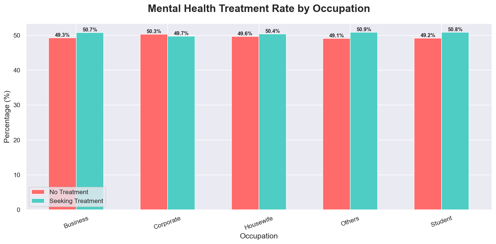
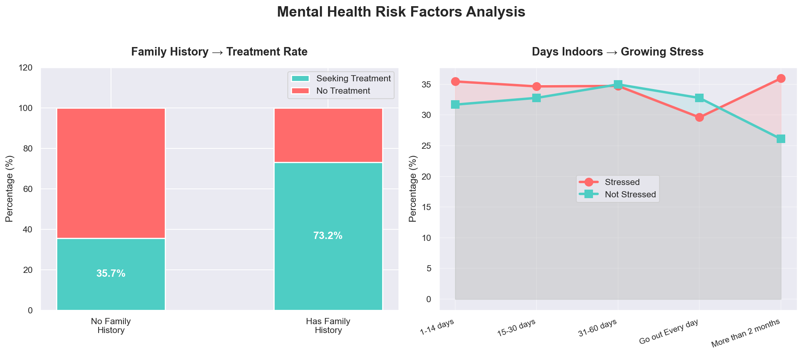
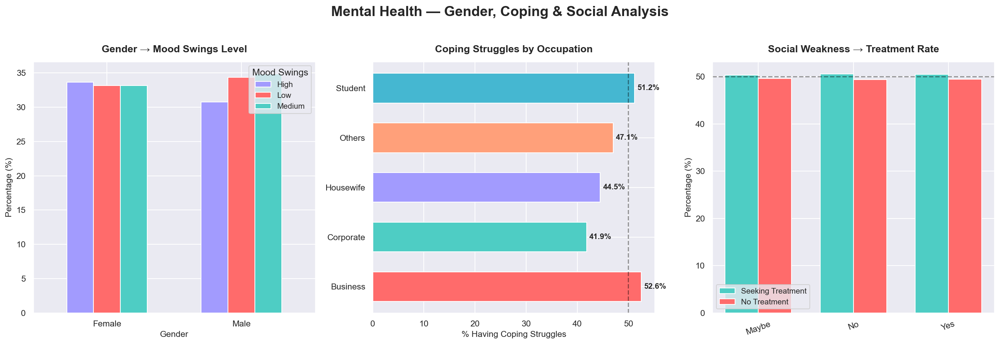

# mental-health-analysis
# 🧠 Mental Health & Depression Analysis

## Project Overview
Analyzed **292,364+ real-world mental health records** using Python, Power BI, and Tableau 
to uncover actionable insights for corporate wellness programs and healthcare policy.

## 🔍 Key Business Insights
- **50.5%** of individuals are not seeking treatment — critical healthcare gap
- **Corporate sector** has highest treatment rate (50.7%)
- Individuals with **family history** are 2x more likely to seek treatment
- **Days indoors** directly correlates with growing stress levels
- **Social weakness** linked to higher mood swing severity

## 🛠️ Tools & Technologies
| Tool | Purpose |
|------|---------|
| Python + Pandas + NumPy | Data cleaning & analysis |
| Matplotlib + Seaborn | Statistical visualizations |
| Power BI | Interactive business dashboard |
| Tableau Public | Public visualization & live link |

## 📊 Live Dashboards
- 🔴 **Tableau Public (Live):** [Click here to view](https://public.tableau.com/app/profile/areesha.mubeen/viz/MentalHealthAnalysisAreeshaMubeen/TreatmentRatebyOccupation)
- 📁 **Power BI Dashboard:** Available in `/dashboards` folder

## 📈 Visualizations
### Chart 1 — Treatment Rate by Occupation

### Chart 2 — Risk Factors Analysis

### Chart 3 — Gender, Coping & Social Analysis

## 📂 Project Structure
